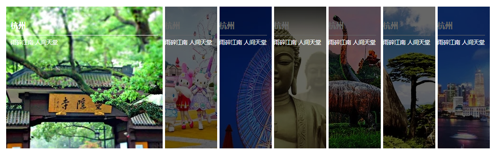
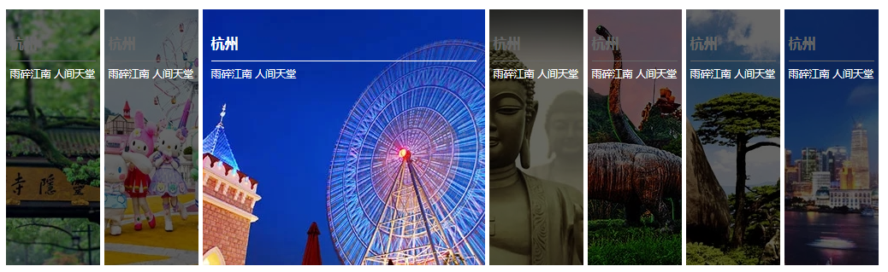

#### 
#### 实现效果
鼠标未上移效果

鼠标上移效果



#### html代码

``` html
    <ul>
        <li class="li_1 first"><h3>杭州</h3><p>雨碎江南 人间天堂</p><span></span></li>
        <li class="li_2"><h3>杭州</h3><p>雨碎江南 人间天堂</p><span></span></li>
        <li class="li_3"><h3>杭州</h3><p>雨碎江南 人间天堂</p><span></span></li>
        <li class="li_4"><h3>杭州</h3><p>雨碎江南 人间天堂</p><span></span></li>
        <li class="li_5"><h3>杭州</h3><p>雨碎江南 人间天堂</p><span></span></li>
        <li class="li_6"><h3>杭州</h3><p>雨碎江南 人间天堂</p><span></span></li>
        <li class="li_7"><h3>杭州</h3><p>雨碎江南 人间天堂</p><span></span></li>
    </ul>
```

#### css代码

``` css

* {

    padding: 0;
    margin: 0;
}

ul {
    list-style: none;
    width: 1025px;
    height: 300px;
    background: palevioletred;
    margin: 0 auto;
}

li {
    width: 110px;
    height: 300px;
    border-right: 5px solid #fff;
    background: palegreen;
    float: left;
    position: relative;
}

.li_1 {
    background: url(images/m1.jpg) no-repeat center;
}

.li_2 {
    background: url(images/m2.jpg) no-repeat center;
}

.li_3 {
    background: url(images/m3.jpg) no-repeat center;
}

.li_4 {
    background: url(images/m4.jpg) no-repeat center;
}

.li_5 {
    background: url(images/m5.jpg) no-repeat center;
}

.li_6 {
    background: url(images/m6.jpg) no-repeat center;
}

.li_7 {
    background: url(images/m7.jpg) no-repeat center;
}

h3 {
    color: #fff;
    font-size: 16px;
    border-bottom: 1px solid #fff;
    line-height: 40px;
    margin-top: 20px;
    width: 100px;
    z-index: 1;
}

p {
    font-size: 12px;
    color: #fff;
    line-height: 30px;
    position: absolute;
    top: 60px;
    z-index: 1;
}

span {
    width: 110px;
    height: 300px;
    background: #000;
    opacity: 0.6;
    position: absolute;
    left: 0;
    top: 0;
}

.first {
    width: 310px;
    padding: 0 10px;
}

.first span {
    opacity: 0;
}

.first h3 {
    width: 310px;
}

/*先统一所有*/
ul:hover li {
    width: 100px;
    padding: 0 5px;
    transition:all 0.5s;
}

ul:hover li span {
    opacity: 0.6;
}

ul:hover li h3 {
    width: 100px;
    transition:all 0.5s;
}

/*再定义当前*/
ul:hover li:hover {
    width: 310px;
    padding: 0 10px;
}

ul:hover li:hover span {
    opacity: 0;
}

ul:hover li:hover h3 {
    width: 310px;
}
```

#### 总结
1.hover 选择器
    解释：:hover 选择器用于鼠标上移的元素。:hover 选择器可用于所有元素，不只是链接。
    拓展：:link 选择器设置指向未被访问页面的链接的样式，:visited 选择器用于设置指向已被访问的页面的链接，:active 选择器用于活动链接。在 CSS 定义中，:hover 必须位于 :link 和 :visited 之后（如果存在的话），这样样式才能生效。

2.transition属性
    解释：transition是CSS3一个简写属性，用于设置四个过渡属性：
    transition-property：规定设置过渡效果的 CSS 属性的名称。
    transition-duration：规定完成过渡效果需要多少秒或毫秒。
    transition-timing-function：规定速度效果的速度曲线。
    transition-delay：定义过渡效果何时开始。