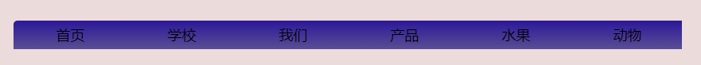
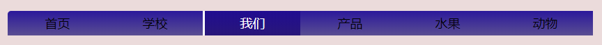
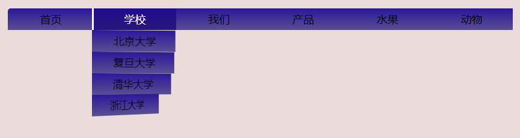
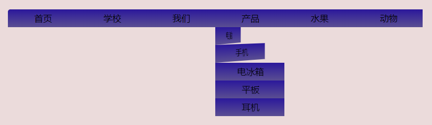

### 鼠标滑过时效果图






### 导航栏架构

    对于导航栏的实现，采用的是ul-li的结构，为了实现鼠标滑过的效果，在li标签中添加a标签，其结构的html代码如下：

#### HTML

``` html
    <div class="container">

        <ul class="menu">
            <li><a href="#">首页</a></li>
            <li><a href="#">学校</a>
                <ul class="submenu">
                    <li><a href="#">北京大学</a></li>
                    <li><a href="#">复旦大学</a></li>
                    <li><a href="#">清华大学</a></li>
                    <li><a href="#">浙江大学</a></li>
                    <li><a href="#">南京大学</a></li>
                </ul>
            </li>
            <li><a href="#">我们</a></li>
            <li><a href="#">产品</a>
                <ul class="submenu">
                    <li><a href="#">电脑</a></li>
                    <li><a href="#">手机</a></li>
                    <li><a href="#">电冰箱</a></li>
                    <li><a href="#">平板</a></li>
                    <li><a href="#">耳机</a></li>
                </ul>
            </li>
            <li><a href="#">水果</a></li>
            <li><a href="#">动物</a></li>
        </ul>
    </div>
```

### 页面布局

    对于导航栏的页面布局需要进行样式的初始化，还有body,ul,li,a等的固有样式，实现水平方向的导航

#### CSS

``` css

* {

    margin: 0;
    padding: 0;
    list-style: none;
    text-decoration: none;
}

body {
    background: #ebdbdb;
}

.container {
    margin: 100px auto;
    width: 840px;
}

.container .menu {
    height: 70px;
}

.container .menu li {
    width: 140px;
    background: linear-gradient(#2b189b, #5a4e92);
    /*背景为从上到下的渐变*/
}

.container .menu>li {
    /*只将一级菜单栏水平布局，需要用>(表示取得menu的子代，且只取一代)*/
    float: left;
    position: relative;
    /*为了消除重叠效果，需要让其子元素脱离文档流absolute*/
}

.container .menu>li:first-child {
    border-radius: 5px 0 0 0;
}

.container .menu a {
    display: block;
    /*将a标签转为块级元素*/
    text-align: center;
    color: black;
    font-size: 18px;
    line-height: 36px;
    /*撑开行高*/
    border-left: 3px solid rgba(58, 12, 165, 0);
}
```

##### 动画效果

    为了实现动画的3D效果，需要为元素设置一个景深(perspective)，也就是元素将对于观察者的距离。另外要用到CSS3中的一个旋转效果transform:rotateY(90deg); 参数为旋转角度，单位为deg。
    同时，我们还可以调整初始旋转坐标轴的位置 transform-origin:x y; 这两个参数分别表示x y轴初始的偏移位置。为了实现旋转的动画，我们需要通过transform:rotateY给出一个初始状态，一个结束状态，并添加一个过渡transition。即可实现旋转效果。
    cubic-bezier 又称三次贝塞尔，用四个点（p0,p1,p2,p3）描绘一条曲线。在css3中，p0默认为（0，0），p3默认为（1，1）。所以，我们只需关注p1，p2。在css3动画中，用来表示速度曲线。

``` css
/* 鼠标滑过 */
.menu li:hover {
    background: linear-gradient(#200c91, #291779)
}

.menu li:hover>a {
    /*同上文，只取其第一子代*/
    color: #ffffff;
    border-left: 3px solid #ffffff;
}

/* 二级 */
.submenu {
    position: absolute;
    /*脱离文档流，定位相对于父级第一个有定位的元素*/
    left: 0;
    top: 100%;
    /*相对于父级li最底部进行定位*/
    max-height: 0;
    /*默认情况下需要将其隐藏，行高缩小至0*/    
    z-index: 1;
    perspective: 800px;
    /*设置景深*/
}

.submenu li {
    visibility: hidden;/*避免有元素占位，鼠标滑过下方空白区域时会触发的Bug*/
    transform: rotateY(90deg);
    transition: all 0.8s cubic-bezier(0.075, 0.82, 0.165, 1);/*贝塞尔曲线(速度曲线)*/
    transform-origin: 0 0;
}

.menu>li:hover .submenu {
    max-height: 500px;
    z-index: 10;
}

.menu>li:hover .submenu li {
    visibility: visible;
    transform: rotateY(0deg);
}
```
##### 子元素选择器与动画延迟
    在这里我们为了实现百叶窗效果，可以通过子元素选择器nth-child(n)，来选择导航栏中不同的项进行旋转通过动画延迟transition-delay，来为不同子元素设置旋转间隔。
    
```css
/* 动画延时 */
.submenu li:nth-child(1) {
    transition-delay: 0ms;
}

.submenu li:nth-child(2) {
    transition-delay: 100ms;
}

.submenu li:nth-child(3) {
    transition-delay: 200ms;
}

.submenu li:nth-child(4) {
    transition-delay: 300ms;
}

.submenu li:nth-child(5) {
    transition-delay: 400ms;
}
```

###  总结
　本次通过编写导航栏特效，在练习导航栏基本写法的同时，练习了一些CSS3的特性：
    景深：perspective
    旋转动画特效：transform:rotateY(45deg);参数为绕y轴旋转角度。
    渐变色效果：linear-gradient(#color1,#color2);
    动画延迟：transition-delay
