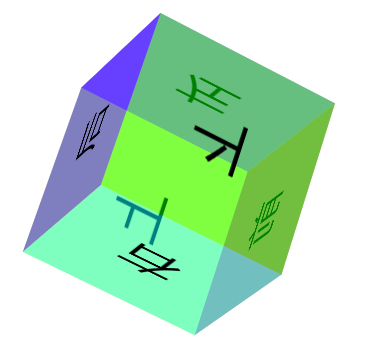

### 效果图
图一：初始静态图

图二：transform:rotate3d(1,1,1,30deg) 

图三：在规定时间内线性旋转  


### HTML代码

``` html
<div class="all">
    <div class="box">
        <div>前</div>
        <div>后</div>
        <div>左</div>
        <div>右</div>
        <div>上</div>
        <div>下</div>
    </div>
</div>
```

### CSS代码

``` css
    .all {
        width: 1200px;
        height: 600px;
        perspective: 3000px;/*景深*/
    }

    .box {
        width: 200px;
        height: 200px;
        margin: 150px auto;
        transform-style: preserve-3d;
        position: relative;
        transform: rotate3d(1, 1, 1, 30deg);/*旋转*/
        animation: rotate 10s linear 0s infinite;/*动画*/
    }

    .box div {
        width: 200px;
        height: 200px;
        font-size: 60px;
        line-height: 200px;
        text-align: center;
        position: absolute;
    }

    .box div:nth-child(1) {
        background: rgba(204, 0, 0, .5);
        transform: translatez(100px)/*转换 移位*/
    }

    .box div:nth-child(2) {
        background: rgba(0, 0, 255, .5);
        transform: rotatey(180deg) translatez(100px)
    }

    .box div:nth-child(3) {
        background: rgba(155, 0, 255, .5);
        transform: rotatey(-90deg) translatez(100px)
    }

    .box div:nth-child(4) {
        background: rgba(0, 255, 255, .5);
        transform: rotatey(90deg) translatez(100px)
    }

    .box div:nth-child(5) {
        background: rgba(255, 255, 0, .5);
        transform: rotatex(90deg) translatez(100px)
    }

    .box div:nth-child(6) {
        background: rgba(0, 255, 0, .5);
        transform: rotatex(-90deg) translatez(100px)
    }
    /*关键帧*/
    @keyframes rotate {
        from {
            transform: rotate3d(1, 1, 1, 30deg)
        }

        to {
            transform: rotate3d(1, 1, 1, 360deg)
        }
    }
```

