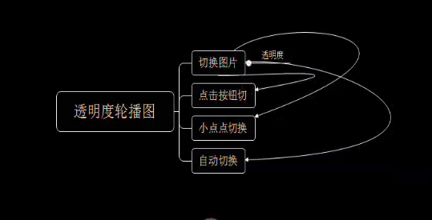
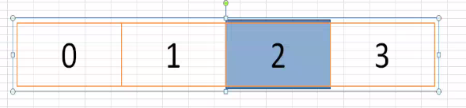

#### 说明
    轮播图是网页上常见的效果之一，对于轮播图的功能，要求不同，效果也不同(在这里分享一下，用js原生代码，实现轮播图的常见效果！思路比较清晰，而且可重复性高，也几乎包含了现在网页上轮播实现的所有效果！)(想看完整代码代码，就到github下)
#### 描述(透明度轮播图===>例如：京东)

    轮播图1：其核心为切换图片，是实现其他几个效果的基础


    关键技术：图片的转换牵涉到了层叠，做到这些，是我们js的第一步。因为几乎所有的轮播都要实现这些效果，我们再能做一个封装，随时调用,我在这里封装了一个名叫slideNext和slidPrev的函数;我们的轮播图要动起来，利用定时器实现自动滚动的效果，我在这里封装了一个名叫auto的函数，函数封装完成后我们只需要调用即可实现：

#### js核心代码

``` js
var currentIndex = 0;

function slideTo(index) {
    console.log(currentIndex);
    if (index === 4) {
        index = currentIndex = 0;
    }
    if (index === -1) {
        index = currentIndex = 3;
    }
    var lis = document.querySelectorAll('.slider .list li');
    document.querySelector('.current').classList.remove('current');
    lis[index].classList.add('current');
}

function slideNext() {
    currentIndex++;
    slideTo(currentIndex);
}

function slidePrev() {
    currentIndex--;
    slideTo(currentIndex);
}

//自动轮播
var id;

function auto() {
    id = setInterval(function() {
        slideNext();
    }, 1500)
}

function stop() {
    clearInterval(id);
}
auto();
document.querySelector('.slider').onmouseover = function() {
    stop();
}
document.querySelector('.slider').onmouseout = function() {
    auto();
}

//按钮
document.querySelector('.slider .prev').onclick = function() {
    slidePrev()
}
document.querySelector('.slider .next').onclick = function() {
    slideNext();
}

//鼠标上移 
var bullets = document.querySelectorAll('.pagination .bullet');
for (var i = 0; i < bullets.length; i++) {
    bullets[i].index = i;
    bullets[i].onmouseover = function() {
        currentIndex = this.index;
        slideTo(currentIndex);
    }
}
```

#### 描述(轮播图===>例如：淘宝)

    轮播图2：



#### js核心代码

``` js
var currentIndex = 0;

function slideTo(index) {
    console.log(index);
    var list = document.querySelector('.list');
    var liWidth = document.querySelector('.list li').offsetWidth;
    if (index === 5) {
        list.style.transitionDuration = '0s';
        list.style.left = 0;
        setTimeout(function() {
            list.style.transitionDuration = '';
            currentIndex = 1;
            list.style.left = -liWidth + 'px';
        }, 50)
        return;
    }
    if (index === -1) {
        list.style.transitionDuration = '0s'
        list.style.left = -2360 + 'px';
        setTimeout(function() {
            list.style.transitionDuration = ''
            currentIndex = 3
            list.style.left = -liWidth * 3 + 'px';
        }, 50)
        return;
    }
    var left = -index * liWidth;
    list.style.left = left + 'px';
}

function slideNext() {
    currentIndex++;
    slideTo(currentIndex);
}

function slidePrev() {
    currentIndex--;
    slideTo(currentIndex);
}

//绑定事件
document.querySelector('.slider .prev').onclick = function() {
    slidePrev();
}

document.querySelector('.slider .next').onclick = function() {
    slideNext();
}

var bullets = document.querySelectorAll('.pagination .bullet');
for (var i = 0; i < bullets.length; i++) {
    bullets[i].index = i;
    bullets[i].onclick = function() {
        // console.log(this.index);
        currentIndex = this.index;
        slideTo(currentIndex);
    }
}

document.querySelector('.slider').onmouseover = function() {
    stop()
}
document.querySelector('.slider').onmouseout = function() {
    auto()
}
//自动轮播
var id;

function auto() {
    id = setInterval(function() {
        slideNext();
    }, 3000)
}

function stop() {
    clearInterval(id)
}
auto();
```

#### 总结
    好了，轮播图到此为止，这两种轮播图有相同的地方也有不同的地方；希望对你有所帮助