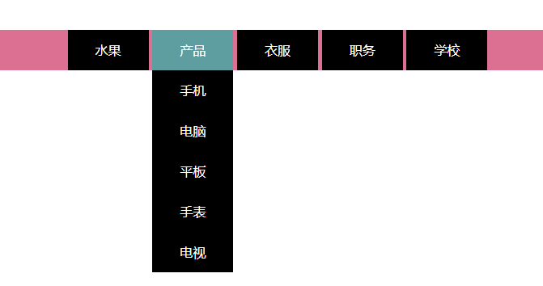
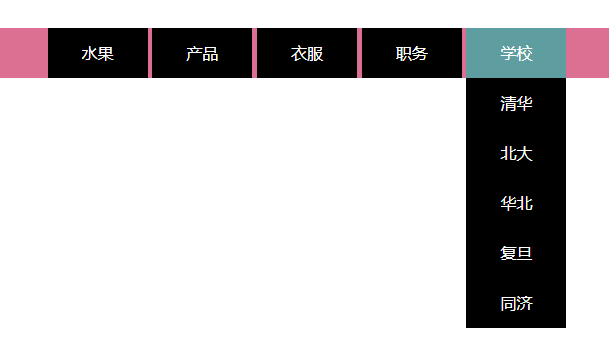

#### 说明
    实现下拉菜单的方法有很多，我用的是使用原生js实现二级下拉菜单
    1.用无序列表ul li 设置一二级菜单的结构，并使二级菜单隐藏
    2.通过CSS给菜单设置样式后，给一级菜单添加onmouseover和onmouseout事件
      来控制二级菜单
    3.注意：this的用法




#### js核心代码

``` js
window.onload = function() {
    var Ul = new ul();
    Ul.over();
}

function ul() {
    this.oul = document.getElementById("ul");
    this.oli = document.getElementsByClassName('li');
    this.oul1 = this.oul.getElementsByTagName('ul');
}
ul.prototype.over = function() {
    var This = this;
    for (var i = 0; i < this.oli.length; i++) {
        this.oli[i].index = i;
        this.oli[i].onmouseover = function() {
            for (var j = 0; j < This.oul1.length; j++) {
                if (this.index == j) {
                    This.oul1[j].style.display = 'block';
                    this.style.background = 'cadetblue';
                }
            }
        }
        this.oli[i].onmouseout = function() {
            This.oul1[this.index].style.display = 'none';
            this.style.background = '';
        }
    }
}
```

